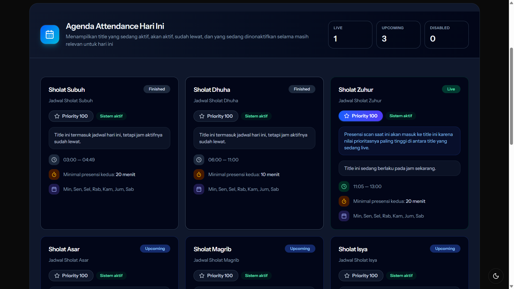
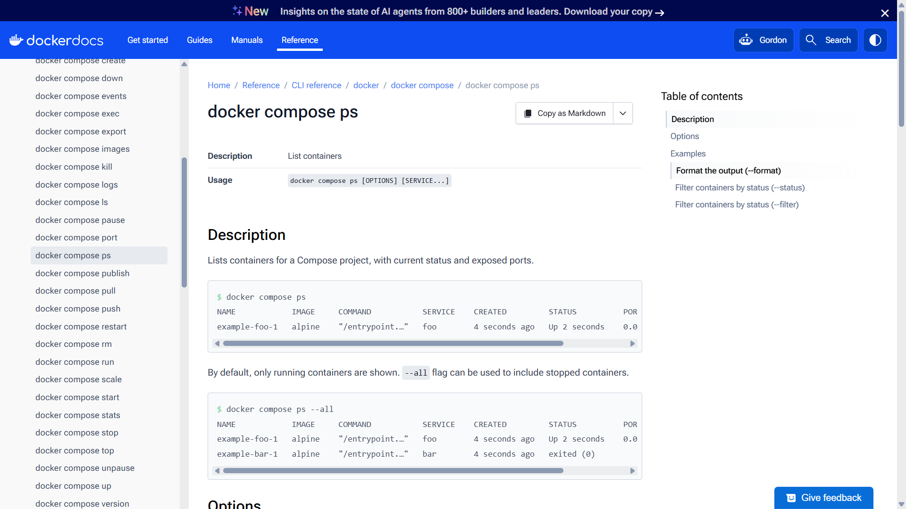

# JAWABAN UJIAN PRAKTIK DOCKER

## Identitas
- Nama: 
- Kelas: 
- No Absen: 
- Port yang digunakan: 

---

## Soal 1: Akses Project melalui SFTP

### Langkah yang dilakukan
- 
- 
- 

### Hasil

---

## Soal 2: Docker Compose (php-nginx-dev-prod)

### Perintah yang digunakan
    (Tuliskan perintah di sini)

### Penjelasan
- Perbedaan dev:
- Perbedaan prod:

### Hasil

---

## Soal 3: Nginx Static Web

### URL yang digunakan
- index.html: 
- style.css: 
- script.js: 

### Perubahan konfigurasi
- 

### Hasil

---

## Soal 4: React App

### Proses Build
    (Tuliskan perintah build)

### Menjalankan Container
    (Tuliskan perintah run)

### Penjelasan
- 
- 
- 

### Hasil

---

## Soal 5: Analisis Project UJIKOM

### Container / Service
- 

### Port Mapping
- 

### Volume
- 

### Network
- 

### Hasil Docker

### Hasil Browser

### Jika Ada Error

**Penyebab:**
- 

**Solusi:**
- 

---

## Catatan Tambahan
- 